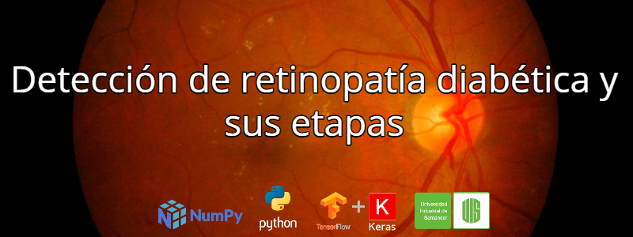

# Detección de Retinopatía Diabética y sus etapas.

**Autores**: Nelson Alexis Cáceres Carreño y Jenny Marcela Santamaría Rincón.

**Autores**|codigo
--|--
Jenny Marcela Santamaría Rincón|2171455
Nelson Alexis Cáceres Carreño|2171763

## Objetivos
* Detectar las diferentes etapas de la retinopatía diabética.
* Clasificar las imágenes de fondo de ojo en sanas o con retinopatía diabética sin especificar el grado de la enfermedad si la padece.
* Analizar las tasas de falsos positivos y falsos negativos brindadas por el modelo planteado.
* Identificar el modelo que mejor se adapte a la hora de detectar las diferentes etapas de la retinopatía diabética.

## Dataset:
El conjunto de datos consta de 35.126 imágenes de escaneo de retina tomadas en un exámen de fondo de ojo, tanto del ojo izquierdo como del derecho. Dichas imágenes se categorizan dependiendo el estado o etapa en la cual se encuentra esta enfermedad ocular:

* **0-Sin retinopatía diabética:** 25.810 imágenes
* **1-Leve:** 2.443 imágenes
* **2-Moderada:** 5.292 imágenes
* **3-Grave:** 873 imágenes
* **4-Retinopatía diabética proliferativa:** 708 imágenes

## Algoritmos utilizados:

1. VGG16
2. **Xception.**
3. InceptionResnetV2.
4. MobileNetV2.

## Enlaces de interes:

1. [Codigo](https://github.com/Alexis3004/Deteccion_Retinopatia_Diabetica/blob/main/Codigo/Deteccion_RD_IA2.ipynb)
2. [Video](https://github.com/EdgarAndresMontenegro/Zebrafish_Behaver_Net/blob/master/Video_Descripcion.mp4)
3. [Presentacion](https://github.com/Alexis3004/Deteccion_Retinopatia_Diabetica/blob/main/Deteccion_RD.pdf)
